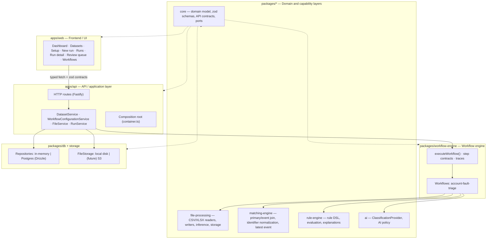

# Architecture

## Goals

1. **Reliable & deterministic** – the same inputs and rule set always produce the same output.
2. **Explainable** – every populated value traces back to a rule, evidence and a confidence.
3. **Human in the loop** – ambiguity is detected explicitly and routed to a review queue.
4. **Reusable** – the account fault triage use case is the first *workflow program*, not the engine itself.
5. **Extensible without rewrites** – new workflows, file formats, rule sources, AI providers and storage
   backends plug into existing ports.

## Layers

Dependency rule: **inner layers never import outer layers.**
`core` has no dependencies (except zod). `file-processing`, `rule-engine`, `ai` depend on `core`.
`matching-engine` depends only on `file-processing` (reusing its canonical identifier/timestamp helpers).
`workflow-engine` depends on those. `db` implements `core` ports. `api` wires everything. `web` only
consumes `core` contracts (HTTP DTO schemas) and never touches Node-only packages.

## Request / run lifecycle

1. `POST /api/v1/files` (multipart) → `FileService` delegates to `DatasetService`, which validates the
   upload (extension, content type, size, magic bytes), stores it under a generated id, inspects its
   structure and persists both a `FileAsset` (used by runs) and a `DatasetProfile` (used for preview).
   `POST /api/v1/datasets` returns the richer dataset DTO directly; `GET /api/v1/datasets/:id/rows`
   pages rows from storage so the browser never receives the full table.
2. `POST /api/v1/runs` → `RunService.createRun` validates the workflow + files, persists a `queued` run
   and returns **202** immediately; execution happens in the background. A run can be started either with
   explicit file ids (legacy wizard) or with a `configurationId`, in which case
   `WorkflowConfigurationService.buildRunInput` resolves the saved mapping into file ids and workflow
   config keys first.
3. `RunService.execute` builds a `StepContext`, creates the run's step records, then calls
   `workflow.execute(input, ctx)`.
4. `executeWorkflow` (engine) runs the workflow program's steps sequentially, merging state and recording
   per-step status, duration, metrics and errors. A failing step short-circuits the run and keeps the trace.
5. The account-fault-triage program performs: load primary → load events → group by account → select
   latest fault & classify → build output rows, review items and the decision log.
6. `RunService` persists step results, writes artifacts (output CSV, output XLSX, review queue CSV),
   stores decision records and review items, then marks the run succeeded with statistics.
7. The web app polls `GET /api/v1/runs/:id` while the run is queued/running and renders the trace.

## Configuration lifecycle

1. A workflow declares its requirements as data: `RegisteredWorkflow.configuration` holds dataset roles
   (e.g. `primary`, `events`), semantic column roles (`identifier`, `timestamp`, `description`, output
   columns) and scalar options. `GET /api/v1/workflows/:slug` serves this to the UI.
2. The **Setup** page assigns an ingested dataset to each role and maps each semantic column role to a
   real detected column, using `DatasetProfile.columns` (`likelyIdentifier`/`likelyDate`/type) to
   suggest defaults. Output columns are a multi-select; leaving it empty keeps every primary column.
3. As the user edits, the page debounces `POST /api/v1/workflow-configurations/validate`.
   `WorkflowConfigurationService` loads the referenced datasets and calls the pure
   `validateWorkflowConfiguration` from `@sheetpilot/core`. Errors block; ambiguous mappings (a date used
   as an identifier, a non-date timestamp that only parses in samples) become blocking until the user
   ticks "I checked this column". The response also previews the resolved run config.
4. `POST /api/v1/workflow-configurations` re-validates and persists the configuration (version 1);
   `PUT /api/v1/workflow-configurations/:id` re-validates and bumps the version.
5. `POST /api/v1/runs` with `{ configurationId }` resolves the configuration through
   `RegisteredWorkflow.resolveRunInput` into `{ primaryFileId, eventsFileId, config }`, where config keys
   are the workflow's expected field names (`primaryAccountColumn`, `eventsTimestampColumn`, …) and the run
   records the `configurationId` for traceability.

## Matching / grouping lifecycle

1. A workflow's load steps read a file into records (one array for primaries, one for events) and extract
   the raw identifier/timestamp cells; they do not decide how records join.
2. The grouping step calls `matchRecords` from `@sheetpilot/matching-engine` with accessor functions
   (`primaryKey`, `eventKey`, `eventTimestamp`). The engine normalizes every identifier through
   `normalizeIdentifier`, joins events to primary entities in one linear pass, and collects events whose
   key matches no primary as `orphans` instead of dropping or duplicating them.
3. Per entity the engine orders the **complete** event history with `compareEventsLatestFirst` (valid
   timestamps descending, then later source row), exposes `latest` plus the full `events[]`, attaches
   `MatchIssue`s (`no_events`, `duplicate_primary`, `ambiguous_latest_timestamp`, `unparsed_timestamp`,
   `no_valid_timestamp`, `identifier_transformed`) and per-entity counts, and returns aggregate `MatchStats`
   (matched/unmatched entities, zero/one/multiple events, orphan events, malformed/missing timestamps).
4. The workflow maps `MatchedEntity[]` back to its own `AccountGroup[]`; classification and output building
   consume the grouped representation and never re-derive the join or "latest".

## Key abstractions (ports & contracts)

| Concept | Location | Notes |
| --- | --- | --- |
| `WorkflowProgram<TState>` | `packages/workflow-engine/src/types.ts` | Ordered typed steps + state factory |
| `RegisteredWorkflow` | `packages/workflow-engine/src/registry.ts` | What the API/registry know about a workflow; executes it and returns generic `WorkflowOutputs` |
| `Repositories` (8 interfaces) | `packages/core/src/ports/repositories.ts` | Persistence ports implemented by in-memory and Postgres adapters |
| `FileStorage` | `packages/core/src/ports/file-storage.ts` | Object storage port; `LocalFileStorage`, `InMemoryFileStorage` today, S3 later |
| `TabularReader` / `TabularWriter` | `packages/file-processing/src/readers`, `writers` | Streaming async-generator contract with `describe()` for sheets/headers; CSV is fully streaming, XLSX is buffered today |
| `inspectDataset` | `packages/file-processing/src/inspection.ts` | Bounded one-pass analysis producing inferred types, emptiness/uniqueness stats, samples and warnings |
| `DatasetService` / `DatasetProfile` | `apps/api/src/services/dataset-service.ts`, `packages/core/src/domain/dataset.ts` | Normalized, persisted dataset representation consumed by later workflow stages |
| `DatasetRepository` | `packages/core/src/ports/datasets.ts` | Persistence port for dataset profiles (in-memory and Postgres adapters) |
| `WorkflowConfigurationDefinition` | `packages/core/src/domain/workflow-config.ts` | A workflow's declared dataset roles, semantic column roles and options (data, not UI) |
| `WorkflowConfiguration` | `packages/core/src/domain/workflow-config.ts` | Persisted, versioned assignment + mapping for one setup; reusable across daily files |
| `validateWorkflowConfiguration` | `packages/core/src/domain/workflow-config.ts` | Pure structural + semantic validation shared by the API and (via the endpoint) the UI |
| `WorkflowConfigurationRepository` | `packages/core/src/ports/workflow-configurations.ts` | Persistence port for configurations (in-memory and Postgres adapters) |
| `resolveRunInput` | `packages/workflow-engine/src/workflows/account-faults/configuration.ts` | Maps a saved configuration to the workflow's concrete run input |
| `matchRecords` | `packages/matching-engine/src/match.ts` | Generic primary↔event join + grouping + deterministic latest selection; returns `MatchedEntity[]`, orphans and `MatchStats` |
| `normalizeIdentifier` | `packages/matching-engine/src/normalize.ts` | Reported identifier normalization; defaults equal `normalizeKey`; dangerous merges opt-in |
| `compareEventsLatestFirst` | `packages/matching-engine/src/match.ts` | The single deterministic latest-event comparator |
| `Rule`, `ConditionGroup`, `RuleAction` | `packages/core/src/domain/rules.ts` | Business rules are data with zod validation, versioned in `RuleSet`s |
| `evaluateRules` | `packages/rule-engine/src/evaluate.ts` | Deterministic winner: priority ↓, specificity ↓, rule id ↑; conflicts reported |
| `ClassificationProvider` | `packages/core/src/ports/classification.ts` | AI port; `NoopClassificationProvider` today |
| `decideAiUsage` | `packages/ai/src/policy.ts` | AI is only consulted per explicit policy and never overrides a deterministic match |
| API DTO schemas | `packages/core/src/api/contracts.ts` | Single source of truth for request/response shapes used by API and web |

## Determinism and traceability rules

- Rules are evaluated by priority, then by number of conditions (specificity), then by rule id, so the
  winner never depends on map/array ordering.
- Records are matched on a normalized identifier only. `normalizeIdentifier` reports every transformation
  it applies; steps that can merge genuinely distinct identifiers (`stripSeparators`, `stripLeadingZeros`)
  are off by default, and using them marks the entity with the `identifier_transformed` issue.
- The latest fault/event is chosen by timestamp (descending), with the later source row as the deterministic
  tie-breaker; an event with a valid timestamp always beats one that is missing or unparseable; equal latest
  timestamps raise `ambiguous_latest_timestamp`. Entities keep their first-seen primary order and their
  complete event history.
- Confidence is rule-declared. Accounts below `reviewBelowConfidence` are queued for review rather than
  being silently accepted.
- Every account produces a `DecisionRecord` with matched rules, evidence (fault count, latest fault,
  earlier faults, explanation, AI suggestions) and review reasons.
- Artifacts include a `__Explanation` column and a review queue CSV so the result is auditable outside
  the app.

## Extension points for later sessions

| Need | Where to plug in |
| --- | --- |
| New workflow (different use case) | Add a program under `packages/workflow-engine/src/workflows/*`, declare its `configuration` definition + `resolveRunInput`, and register it in `registry.ts`; reuse `matchRecords` for the join |
| Different matching keys/precedence | Pass new accessors or a custom `parseTimestamp` to `matchRecords`; extend `MatchIssueCode` if a new anomaly matters |
| Configurable identifier normalization | The `IdentifierNormalizationOptions` already exist; expose them through a workflow option/config field and thread them into `matchRecords` |
| Chunked / out-of-core matching | Keep the `MatchRecordsInput/Result` contract and replace the loader that feeds `matchRecords` (or add a reducer-style API) |
| Editable workflow mapping | `WorkflowConfiguration` + repository already exist; add a compare/merge UI and immutable version snapshots |
| Real AI provider | Implement `ClassificationProvider` in `packages/ai` and wire it in `createClassificationProvider` |
| Editable/persisted rules | `RuleSetRepository` + `rule_sets` table already exist; the API reads rules from the registry today |
| S3/blob storage | Implement `FileStorage`; `createContainer` selects the driver |
| Background queue / scheduling | Replace the fire-and-forget call in `RunService.createRun` with a queue; run state already lives in the `runs` table |
| Large XLSX streaming | Swap `XlsxTabularReader` for an ExcelJS streaming reader behind the same `TabularReader` interface |
| DuckDB / chunked inspection | Replace the `inspectDataset` pass behind `DatasetService`; the persisted `DatasetProfile` contract stays the same |
| Multi-tenant isolation | Add `tenantId` to entities/ports and scope repositories |

## Deliberate non-goals in this foundation

- No authentication/authorization yet (single-tenant, local deployment).
- No scheduler/cron or watched-folder ingestion yet.
- No editable UI for rules; rule sets ship as code-validated data.
- Runs execute in-process (no worker pool); large-file parallelism and cancellation API come later.
- Review resolutions are recorded but do not yet regenerate the output artifact.
