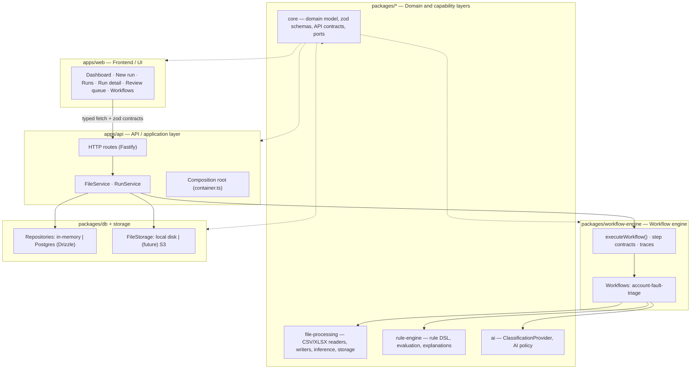

# Architecture

## Goals

1. **Reliable & deterministic** – the same inputs and rule set always produce the same output.
2. **Explainable** – every populated value traces back to a rule, evidence and a confidence.
3. **Human in the loop** – ambiguity is detected explicitly and routed to a review queue.
4. **Reusable** – the account fault triage use case is the first *workflow program*, not the engine itself.
5. **Extensible without rewrites** – new workflows, file formats, rule sources, AI providers and storage
   backends plug into existing ports.

## Layers

Dependency rule: **inner layers never import outer layers.**
`core` has no dependencies (except zod). `file-processing`, `rule-engine`, `ai` depend on `core`.
`workflow-engine` depends on those. `db` implements `core` ports. `api` wires everything. `web` only
consumes `core` contracts (HTTP DTO schemas) and never touches Node-only packages.

## Request / run lifecycle

1. `POST /api/v1/files` (multipart) → `FileService` detects the format, stores the file, reads the header
   row and row count, persists a `FileAsset`.
2. `POST /api/v1/runs` → `RunService.createRun` validates the workflow + files, persists a `queued` run
   and returns **202** immediately; execution happens in the background.
3. `RunService.execute` builds a `StepContext`, creates the run's step records, then calls
   `workflow.execute(input, ctx)`.
4. `executeWorkflow` (engine) runs the workflow program's steps sequentially, merging state and recording
   per-step status, duration, metrics and errors. A failing step short-circuits the run and keeps the trace.
5. The account-fault-triage program performs: load primary → load events → group by account → select
   latest fault & classify → build output rows, review items and the decision log.
6. `RunService` persists step results, writes artifacts (output CSV, output XLSX, review queue CSV),
   stores decision records and review items, then marks the run succeeded with statistics.
7. The web app polls `GET /api/v1/runs/:id` while the run is queued/running and renders the trace.

## Key abstractions (ports & contracts)

| Concept | Location | Notes |
| --- | --- | --- |
| `WorkflowProgram<TState>` | `packages/workflow-engine/src/types.ts` | Ordered typed steps + state factory |
| `RegisteredWorkflow` | `packages/workflow-engine/src/registry.ts` | What the API/registry know about a workflow; executes it and returns generic `WorkflowOutputs` |
| `Repositories` (8 interfaces) | `packages/core/src/ports/repositories.ts` | Persistence ports implemented by in-memory and Postgres adapters |
| `FileStorage` | `packages/core/src/ports/file-storage.ts` | Object storage port; `LocalFileStorage`, `InMemoryFileStorage` today, S3 later |
| `TabularReader` / `TabularWriter` | `packages/file-processing/src/readers`, `writers` | Streaming async-generator contract; CSV is fully streaming, XLSX is buffered today |
| `Rule`, `ConditionGroup`, `RuleAction` | `packages/core/src/domain/rules.ts` | Business rules are data with zod validation, versioned in `RuleSet`s |
| `evaluateRules` | `packages/rule-engine/src/evaluate.ts` | Deterministic winner: priority ↓, specificity ↓, rule id ↑; conflicts reported |
| `ClassificationProvider` | `packages/core/src/ports/classification.ts` | AI port; `NoopClassificationProvider` today |
| `decideAiUsage` | `packages/ai/src/policy.ts` | AI is only consulted per explicit policy and never overrides a deterministic match |
| API DTO schemas | `packages/core/src/api/contracts.ts` | Single source of truth for request/response shapes used by API and web |

## Determinism and traceability rules

- Rules are evaluated by priority, then by number of conditions (specificity), then by rule id, so the
  winner never depends on map/array ordering.
- The latest fault is chosen by timestamp (descending), with the later source row as the deterministic
  tie-breaker; equal latest timestamps raise `ambiguous_latest_timestamp`.
- Confidence is rule-declared. Accounts below `reviewBelowConfidence` are queued for review rather than
  being silently accepted.
- Every account produces a `DecisionRecord` with matched rules, evidence (fault count, latest fault,
  earlier faults, explanation, AI suggestions) and review reasons.
- Artifacts include a `__Explanation` column and a review queue CSV so the result is auditable outside
  the app.

## Extension points for later sessions

| Need | Where to plug in |
| --- | --- |
| New workflow (different use case) | Add a program under `packages/workflow-engine/src/workflows/*` and register it in `registry.ts` |
| Real AI provider | Implement `ClassificationProvider` in `packages/ai` and wire it in `createClassificationProvider` |
| Editable/persisted rules | `RuleSetRepository` + `rule_sets` table already exist; the API reads rules from the registry today |
| S3/blob storage | Implement `FileStorage`; `createContainer` selects the driver |
| Background queue / scheduling | Replace the fire-and-forget call in `RunService.createRun` with a queue; run state already lives in the `runs` table |
| Large XLSX streaming | Swap `XlsxTabularReader` for an ExcelJS streaming reader behind the same `TabularReader` interface |
| Multi-tenant isolation | Add `tenantId` to entities/ports and scope repositories |

## Deliberate non-goals in this foundation

- No authentication/authorization yet (single-tenant, local deployment).
- No scheduler/cron or watched-folder ingestion yet.
- No editable UI for rules; rule sets ship as code-validated data.
- Runs execute in-process (no worker pool); large-file parallelism and cancellation API come later.
- Review resolutions are recorded but do not yet regenerate the output artifact.
